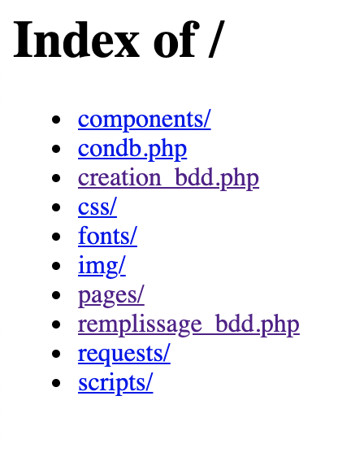
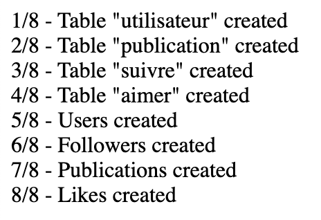

# Projet web - Instagram

Ce projet une reproduction partiel du site instagram.com et quelques une de ses fonctionnalités.

## Pour commencer

Voici quelques instructions pour bien débuter avec notre projet...

### Pré-requis

Ce qu'il est requis pour commencer avec votre projet...

- Un environment web fonctionnel (serveur Web Apache et une base de donnée MySQL)
- Le dossier de notre projet

### Installation

Les étapes pour installer notre projet....

1. Rendez-vous dans le navigateur à la racine du projet cela devrait ressembler à ceci :
   

2. Cliquez ensuite sur le lien _creation_bdd.php_.
    - Vous obtiendrez le message : _Base de donnée créée avec succès_.

3. Revenez à la racine du projet et cliquez sur le lien _remplissage_bdd.php_.
    - Vous obtiendrez le message suivant confirmant le bon remplissage de la base de données :

4. Revenez à la racine du projet et cliquez sur le lien _pages_.
    - Vous obtiendrez une fenêtre avec le contenu suivant :
      

5. Voilà !! Notre projet a été installé avec succès sur votre machine !

## Démarrage

Une fois sur la page de connexion vous avez deux options :

- Vous vous connectez à votre compte déjà existant.
- Vous créer un nouveau compte avant de vous connecter à celui-ci.

### Connexion

Dans le cas ou vous souhaiter vous connecter à votre compte existant, vous aurez besoin de remplir ces champs :

- Nom d'utilisateur : xavier
- Mot de passe : 123

Cela vous permettra d'avoir un aperçu de notre viewer d'image sur la page d'accueil.

### Création

Dans le cas où vous souhaiter créer un nouveau compte, vous aurez besoin, une fois celui-ci créé de vous ajouter des
amis afin de pouvoir profiter pleinement de toutes nos fonctionnalités.

Pour se faire cliquez dans la barre de recherche et commencer à taper l'un des pseudos suivants :

- florent
- antonin
- clementine
- julien
- jean
- sarah

Cliquez sur le pseudo qui s'affiche dans les résultats de recherche. Vous arriverez sur son profil. Vous pourrez ensuite
vous abonner à celui-ci et découvrir dans votre fil d'actualité (bouton maison dans la barre de navigation ou en
cliquant sur le logo Instagram en haut à gauche) ses différentes publications.

## Auteurs

* **Malo Bosc**
* **Mathis Poignet**

